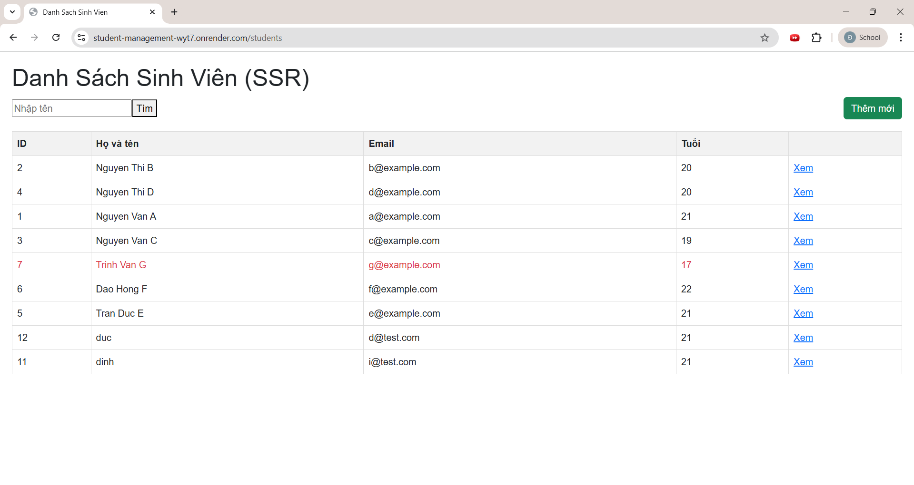
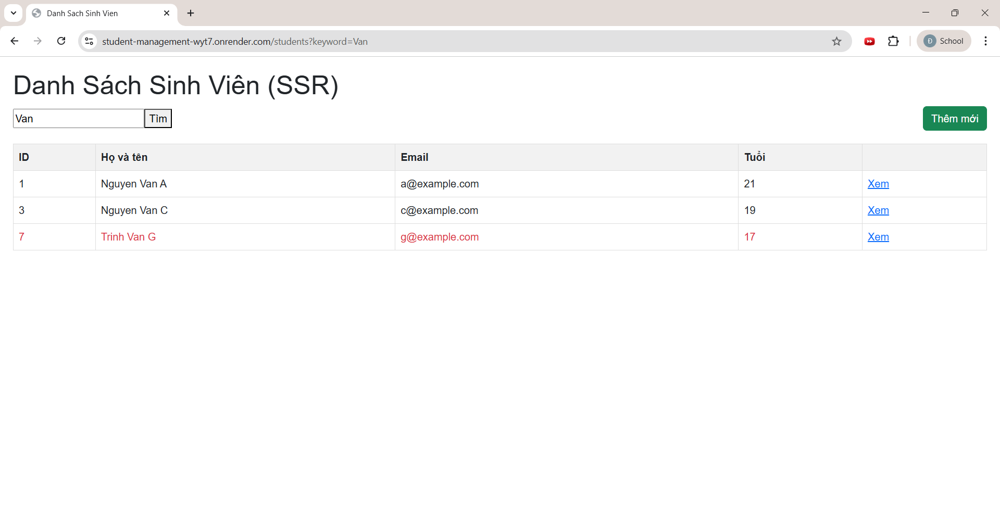
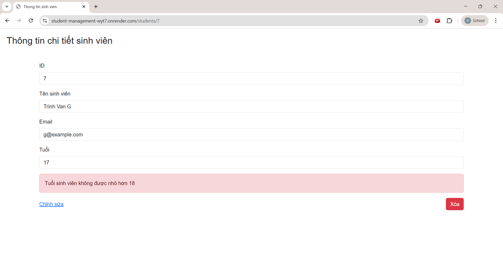
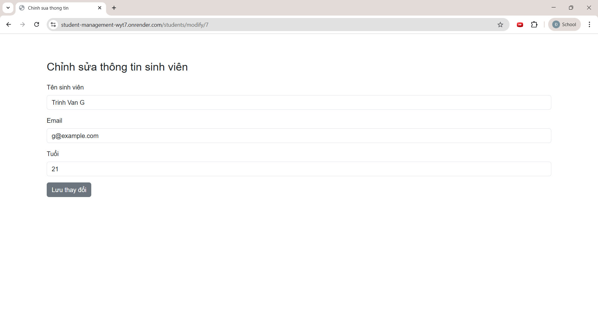
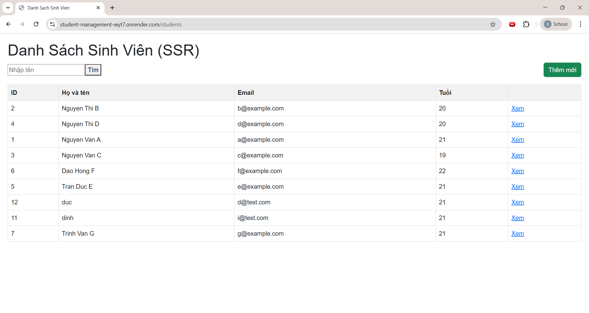
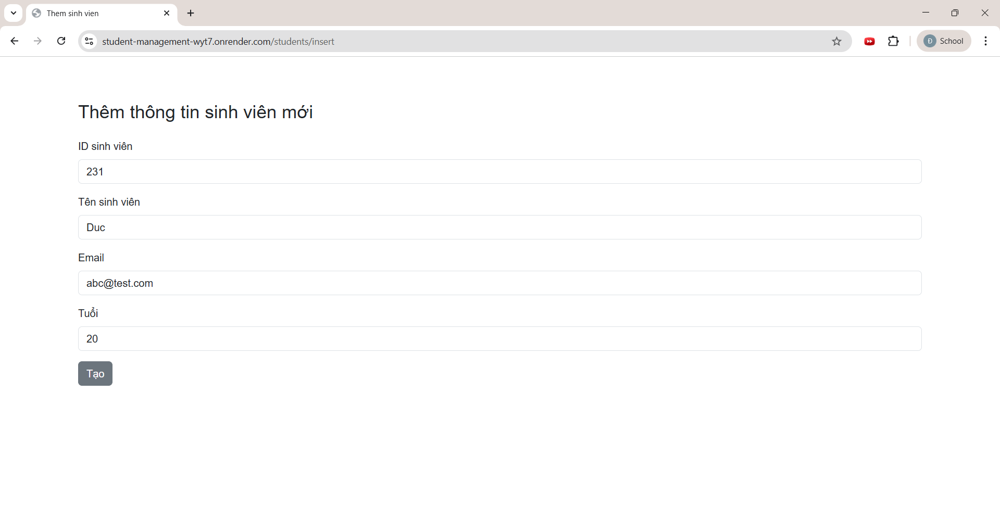
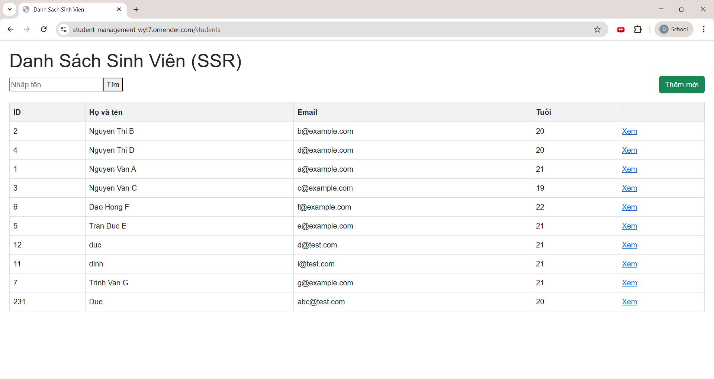
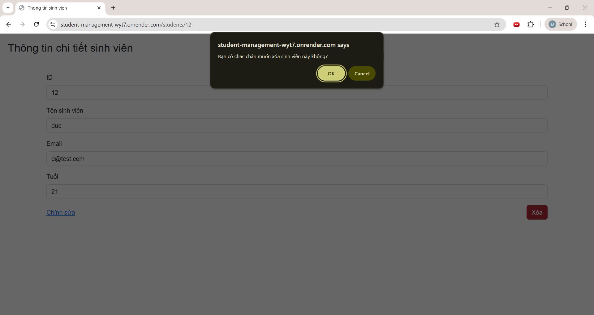
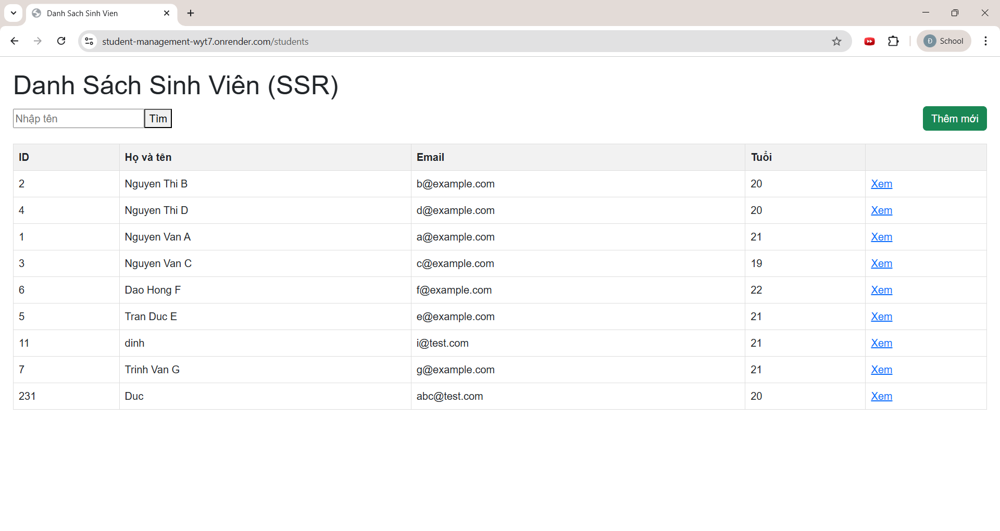

# Student Management System

---

## 1. Danh sách nhóm

- Đoàn Minh Đức – 2310767  
- Trần Phương Đỉnh – 2310744  

---

## 2. URL Web Service

https://student-management-wyt7.onrender.com/students

---

## 3. Cách chạy dự án

### 3.1 Clone repository

```bash
git clone <repository-url>
cd student-management
```
### 3.2 Tạo file .env

Tạo file .env trong thư mục student-management với các biến môi trường sau:
```bash
POSTGRES_HOST=localhost
POSTGRES_PORT=5432
POSTGRES_DB=student_management
POSTGRES_USER=<Your DB Username>
POSTGRES_PASSWORD=<Your DB Password>

SPRING_DATASOURCE_URL=jdbc:postgresql://${POSTGRES_HOST}:${POSTGRES_PORT}/${POSTGRES_DB}
# SPRING_DATASOURCE_URL=<Your Connection String> nếu sử dụng Neon

SPRING_DATASOURCE_USERNAME=${POSTGRES_USER}
SPRING_DATASOURCE_PASSWORD=${POSTGRES_PASSWORD}
```
### 3.3 Chạy chương trình
```bash
./mvnw dependency:resolve
./mvnw spring-boot:run
```
Sau khi chạy thành công, truy cập:

http://localhost:8080/students
## 4. Trả lời câu hỏi
### 4.1 Q1: Ràng buộc Khóa Chính (Primary Key)

Khi cố tình insert một sinh viên có id trùng với bản ghi đã tồn tại, Database sẽ báo lỗi UNIQUE constraint failed.
Lý do là cột khóa chính phải duy nhất để đảm bảo mỗi bản ghi được định danh không trùng lặp.
Nếu cho phép trùng khóa chính, các thao tác cập nhật, xóa hoặc liên kết khóa ngoại sẽ không xác định
được đúng bản ghi cần thao tác.

### 4.2 Q2: Toàn vẹn dữ liệu (Constraints)

Khi insert một sinh viên nhưng để trống cột name (giá trị NULL), Database sẽ không báo lỗi
nếu cột này không được khai báo NOT NULL.

Điều này có thể gây ra:

Hiển thị tên sinh viên bị rỗng

Phát sinh NullPointerException trong Java

Sai lệch logic nghiệp vụ của hệ thống

Do đó cần khai báo ràng buộc dữ liệu phù hợp để đảm bảo toàn vẹn dữ liệu.

### 4.3 Q3: Cấu hình Hibernate

Việc dữ liệu trong Database bị mất mỗi khi tắt và chạy lại ứng dụng thường do cấu hình Hibernate sử dụng
chế độ tự động tạo lại schema, ví dụ:

hibernate.hbm2ddl.auto=create

hibernate.hbm2ddl.auto=create-drop

Các chế độ này sẽ xóa và tạo lại bảng khi ứng dụng khởi động (hoặc tắt), dẫn đến mất dữ liệu cũ.
Để giữ dữ liệu, cần chuyển sang:

spring.jpa.hibernate.ddl-auto=update

hoặc

spring.jpa.hibernate.ddl-auto=validate
## 5. Screenshot module
### 5.1 Trang danh sách

Trang danh sách:


Tìm kiếm tên:                                                                      


### 5.2 Trang chi tiết

Trang chi tiết:


### 5.3 Chức năng sửa

Chỉnh sửa thông tin sinh viên:


Kết quả sau chỉnh sửa:


### 5.4 Chức năng thêm

Thêm sinh viên mới:


Kết quả sau thêm:


### 5.5 Chức năng xóa

Xóa sinh viên:


Kết quả sau khi xóa:


